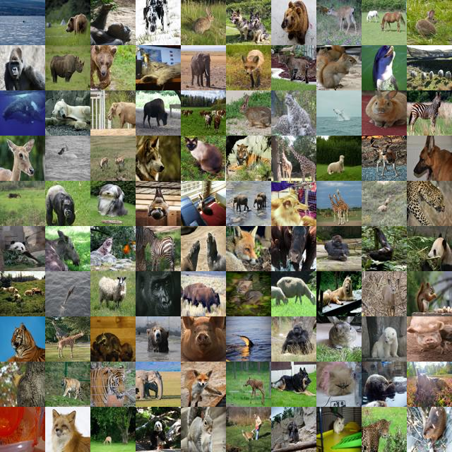
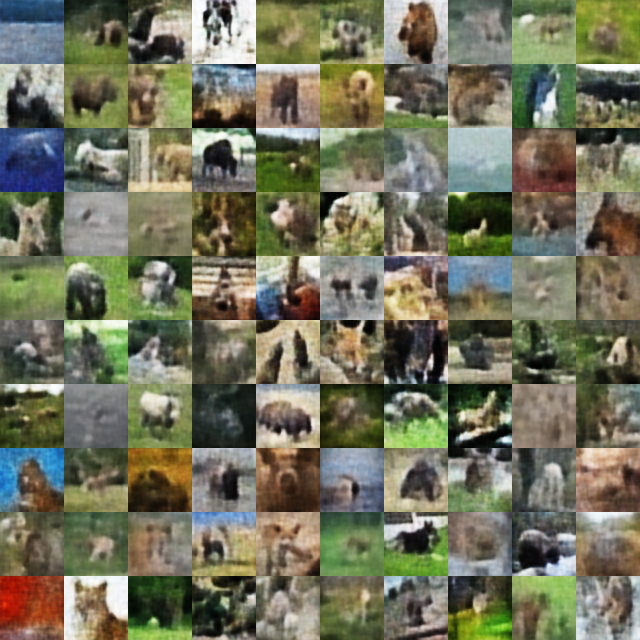
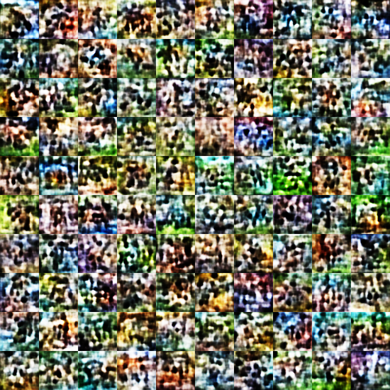

Reproduce the experiment via the following commands (requires Pytorch and WANDB for logging the results)

```shell
./load_datasets.sh

pip install wandb;
pip install lightning;
pip install opencv-python;

wandb login XXXX;

python main.py --z 128 --dataset 3 --epochs 50 --batch_size 64 --num_workers 4 --lr 0.0001
```


**Setup**: In this experiment, we trained an autoencoder (MMD-VAE; a deterministic autoencoder that optimizes reconstruction loss + MMD between the mini-batches and the standard normal as regularizer) to achieve the following results. The model is trained on the AwA2 dataset.

| Ground Truth                                                 | Reconstructed                                                | Samples from Standard Normal distribution                    |
| ------------------------------------------------------------ | ------------------------------------------------------------ | ------------------------------------------------------------ |
|  |  |  |

**Conclusion**: Although the shape is well-defined (standard normal), the deterministic nature of the autoencoder results in the learned space at the bottleneck layer not forming meaningful regions. Instead, it consists of very precise points that correspond to meaningful outputs. If the architecture were probabilistic, not only would the ground truth images be meaningful, but the regions around them would also be meaningful, allowing encodings from samples from a standard normal distribution to produce meaningful images. Analyzing such a latent space is difficult because we wouldn't even know what regions we need to inspect.


More on the MMD-VAE:

[[1706.02262\] InfoVAE: Information Maximizing Variational Autoencoders (arxiv.org)](https://arxiv.org/abs/1706.02262)


Code based on:

[Maximum-Mean-Discrepancy-Variational-Autoencoder/MMD-VAE (InfoVAE).ipynb at master · zacheberhart/Maximum-Mean-Discrepancy-Variational-Autoencoder (github.com)](https://github.com/zacheberhart/Maximum-Mean-Discrepancy-Variational-Autoencoder/blob/master/MMD-VAE (InfoVAE).ipynb)
